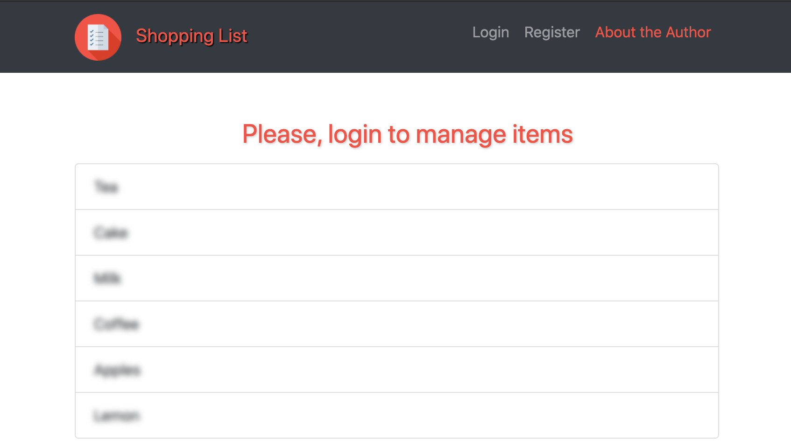
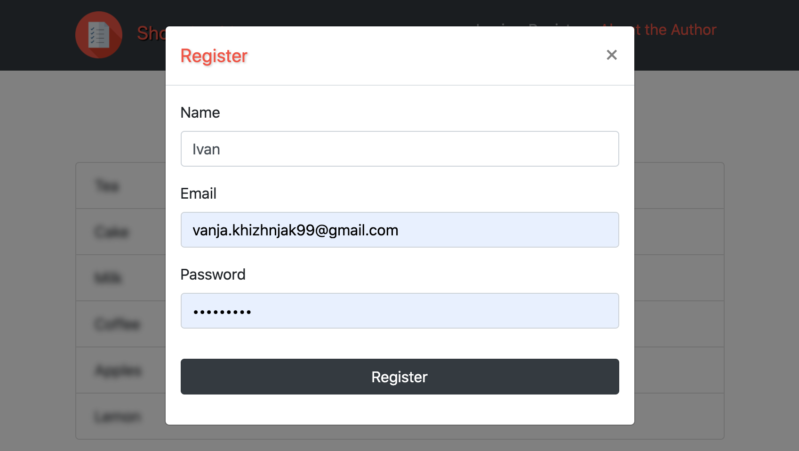
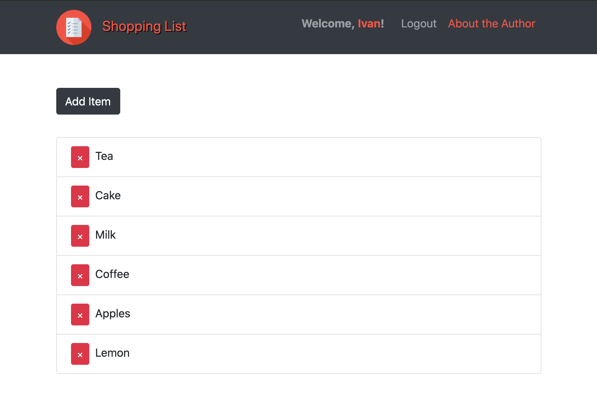
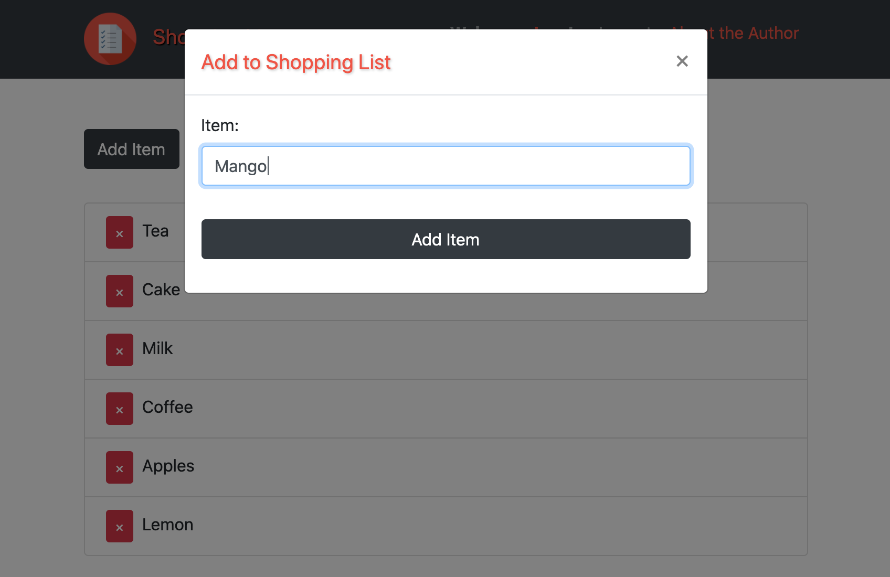
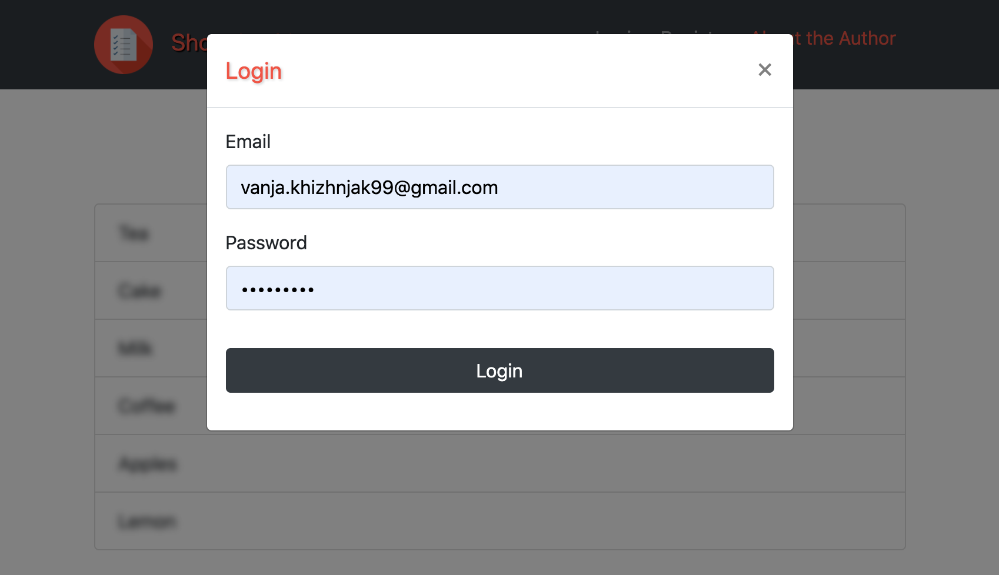
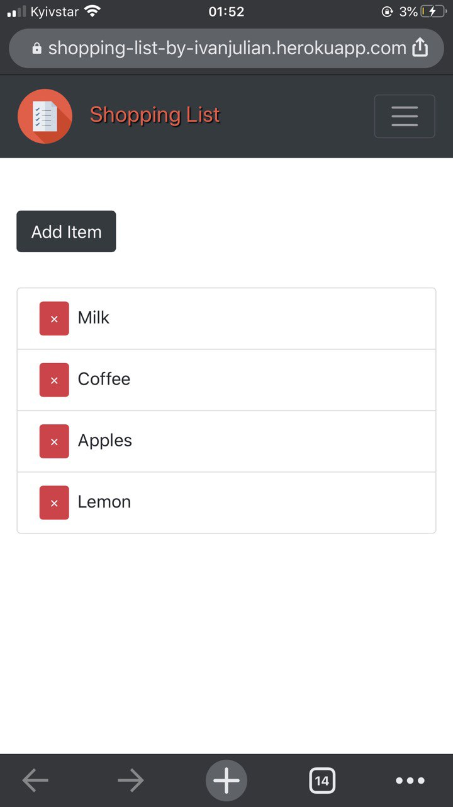
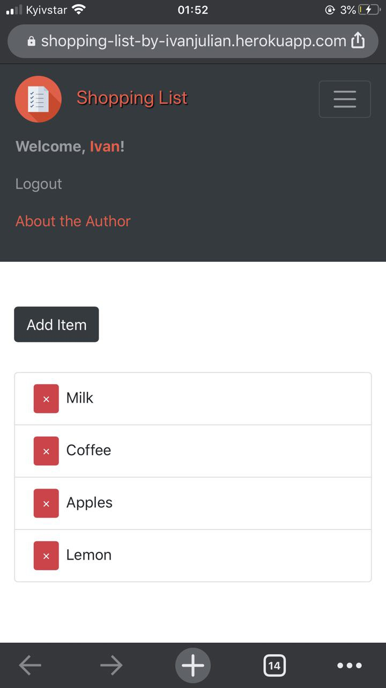

# ShoppingList-MERNstack
 Created with ShoppingList with MERN Stack (MongoDB, Express, React, NodeJS).
 
 ABOUT:
  This is a Shopping List, where you can add items to buy.
  All the items are general, so each registered user could see them.
  
 CREATED with MERN Stack (MongoDB, Express, React, NodeJS).
  
 TODO:
  Soon I'm going to update it to be personal, with personal items.

  
  
  
  
  

  

  
  

  
